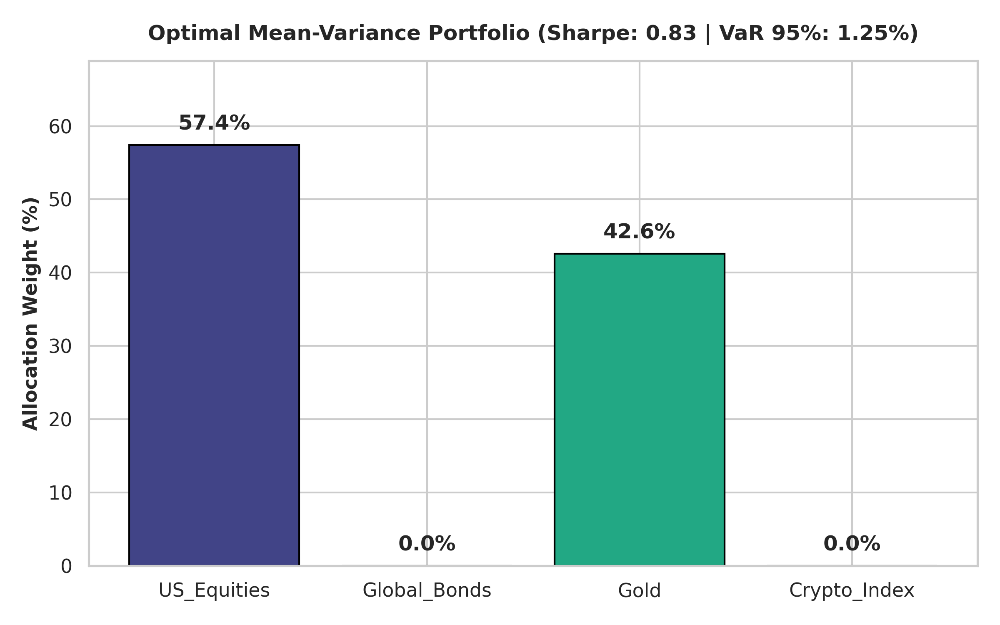

# Quant Matrix Allocator

## 3. Historical Value at Risk (VaR 95%)

$$VaR_{0.95} = -\text{Percentile}_5(R_p)$$

---

## 📊 Live Visual Artifact

> **How to Read This Artifact**
> * **Optimal Weights**: Bars reflect portfolio allocation calculated via SciPy's Mean-Variance Optimization (`scipy.optimize.minimize`) aiming to maximize the Sharpe ratio ($0.83$) under long-only constraints ($\sum w_i = 1, w_i \ge 0$).
> * **Risk Profiles**: Zero-weight allocations (Global Bonds, Crypto Index) indicate sub-optimal risk-adjusted yield relative to the covariance structure during optimization.
> * **Data Source & Pipeline**: Inputs are generated from a multivariate daily returns matrix ($N=1000$ simulation steps) calibrated against historical asset covariance matrices. $95\%$ Historical VaR ($1.25\%$) is computed directly from the 5th percentile of simulated portfolio return distributions ($VaR_{0.95} = -\text{Percentile}_5(R_p)$).

---

## 🛠️ Tech Stack & Quality Gates

* **Core Analytics**: Python 3.10, NumPy, Pandas, SciPy
* **Visualization**: Matplotlib, Seaborn
* **Testing & CI/CD**: Pytest, GitHub Actions
